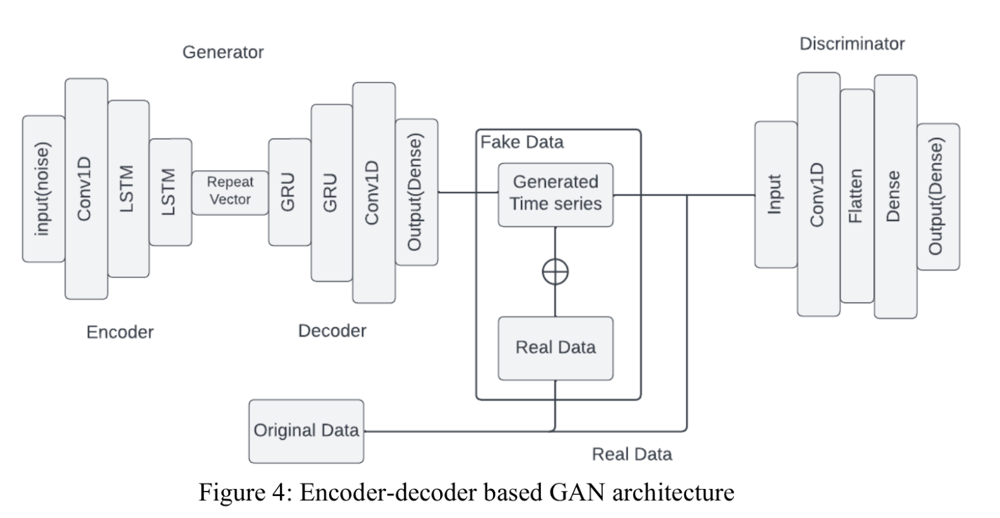

This project contains two different approaches for predicting the stock market price. 

"autoencoder-GAN.ipynb" --> It contains the Autoencoder-based Generative Adversarial Network (GAN) that generates future stock market prices. This code base also compares this model with some other approaches

"Stock_Price_Pred.ipynb" --> It contains a model for predicting stock market prices, based on a parallel neural network.

